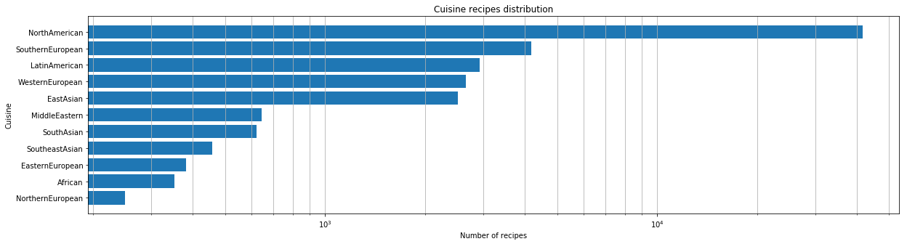
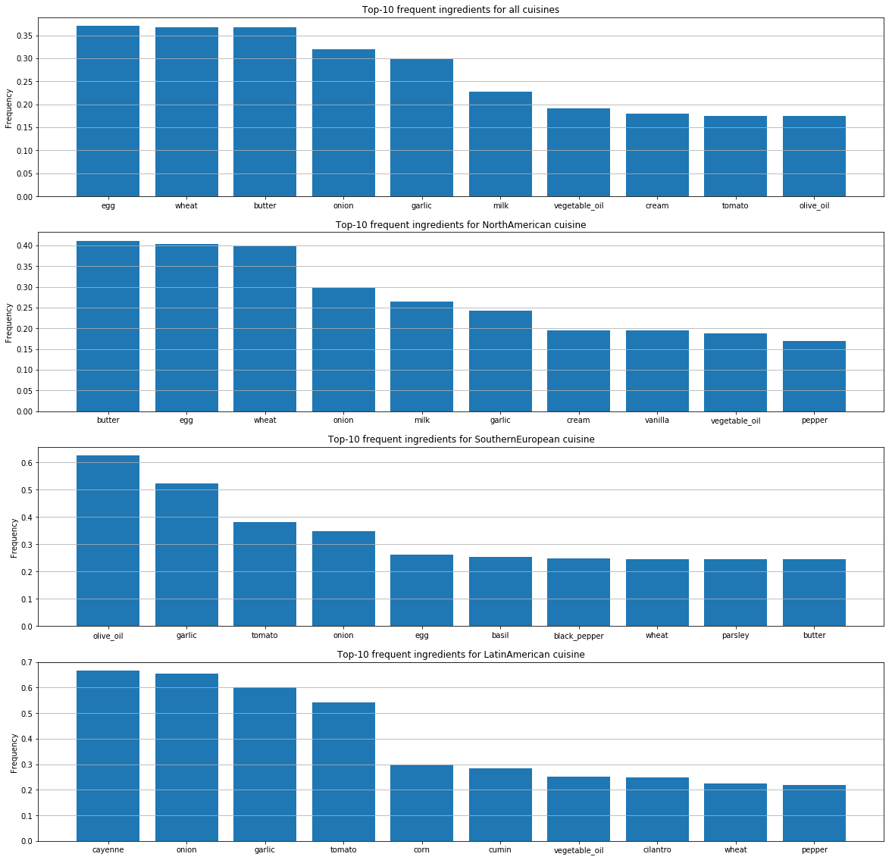
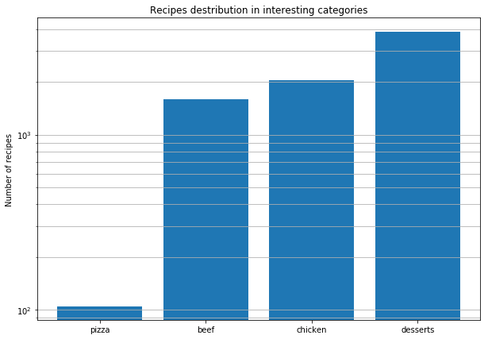
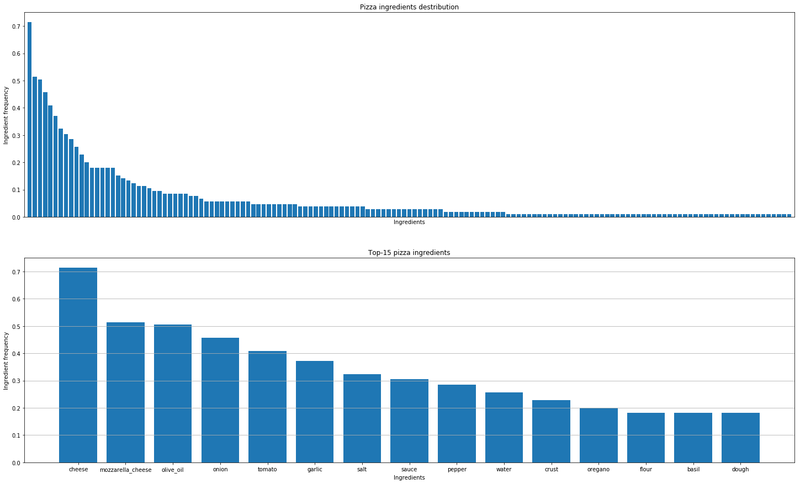
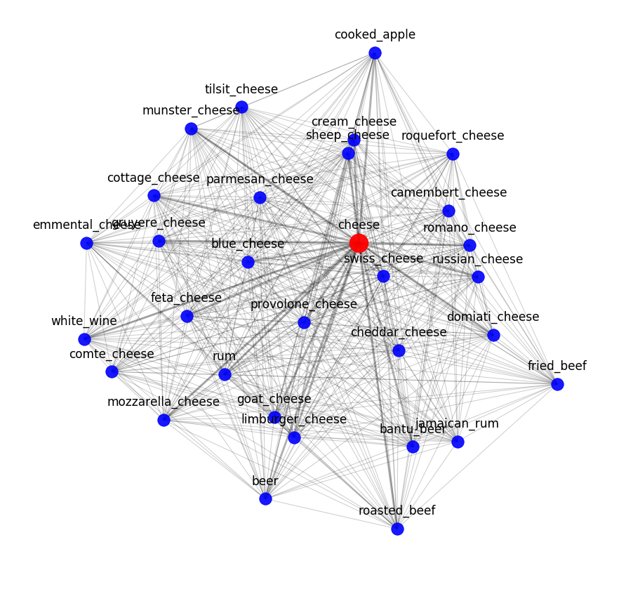
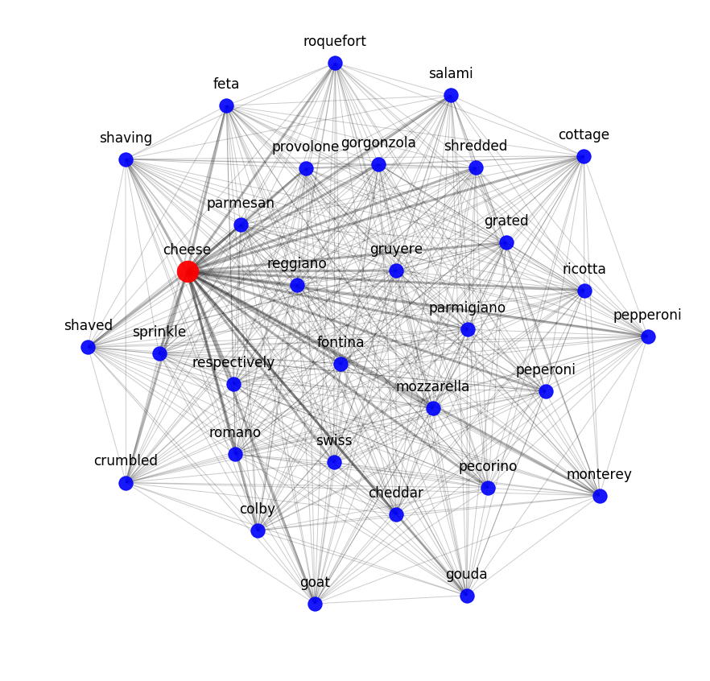
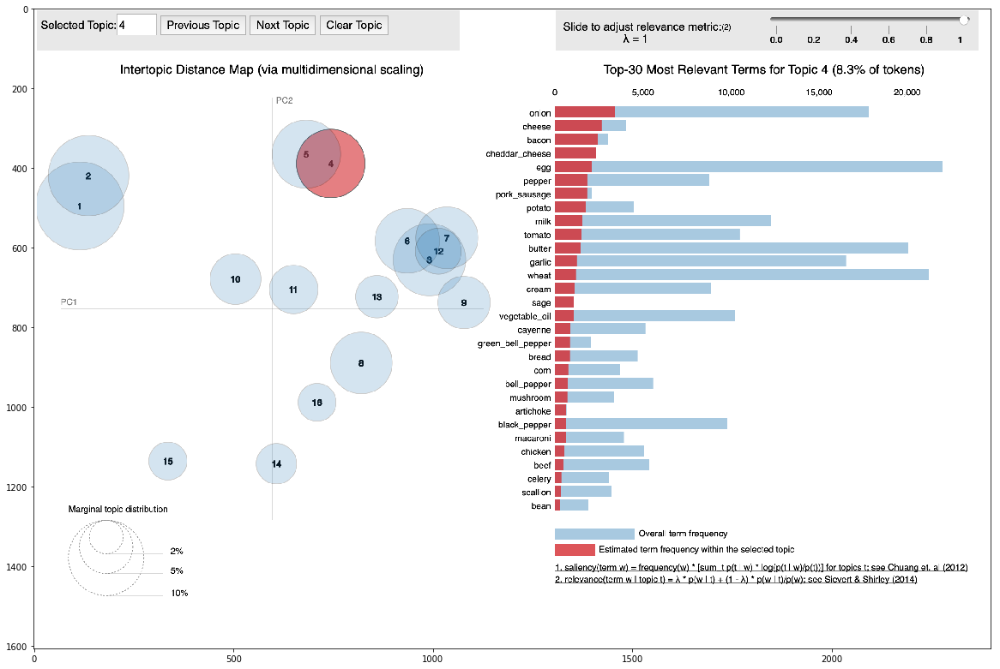
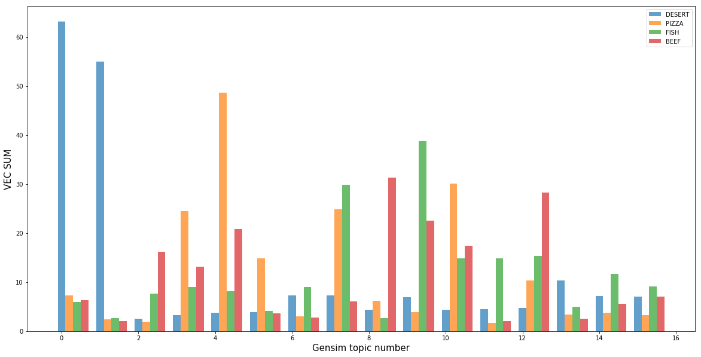
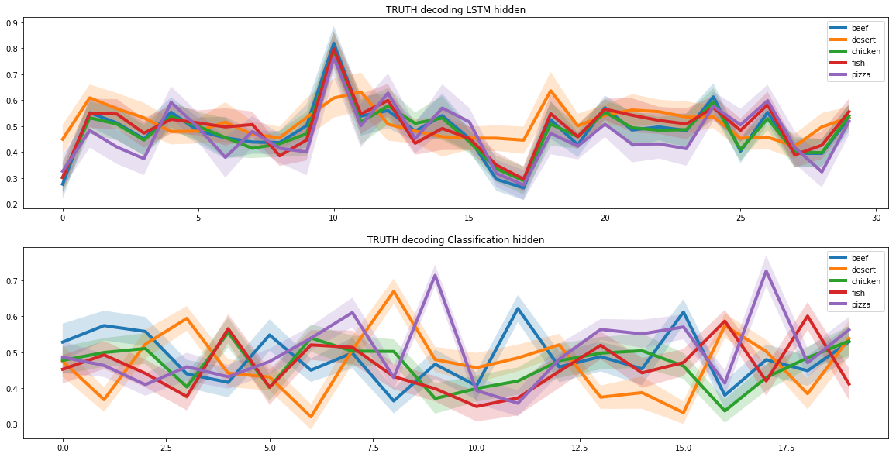
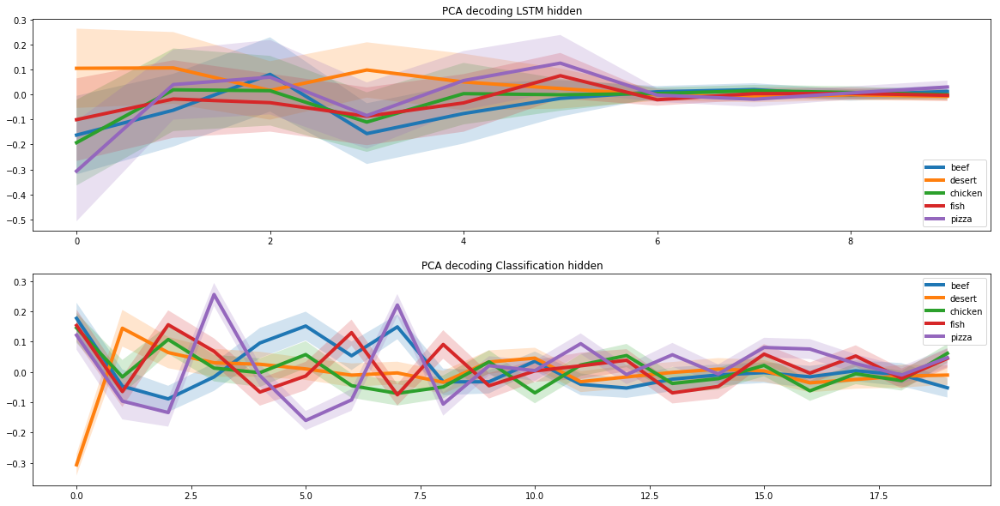

Still, nobody knows if a machine can create something new or it is limited to what it already knows. But even now, artificial intelligence can solve complicated problems and analyze unstructured data sets.
We at Dodo decided to run an experiment. To organize and structurally describe something that is considered chaotic and subjective — the taste. We decided to use artificial intelligence to find the wildest combinations of ingredients that nevertheless will be considered delicious by most of the people.

In collaboration with experts from MIPT and Skoltech, we created artificial intelligence that has analyzed more than 300 000 recipes and research findings on the molecular combinations of ingredients conducted by Cambridge and several other USA universities. Based on this, the AI has learned to find non-obvious connections between ingredients and understand how to pair the ingredients and how the presence of each influences the combinations of all the others. 

# Setting up the dataset

For any model you need data. That’s why to train our AI we collected over 300 000 cooking recipes.

The difficult part was not to collect them but to get them to the same form. For instance, chili pepper in recipes is listed as “chilli”, “chili”, “chiles” or even “chillis”. It’s obvious to us that all of these means “chilli” but neural network consider each of them as individual entity.

Initially, we had over 100 000 unique ingredients, and after we cleaned up the data, only 1 000 unique positions were left.

# Analyzing the data set

Once we have got the dataset, we did an initial analysis. First, we had a quantitative assessment of how many cuisines were present in our dataset.

For each cuisine, we have identified the most popular ingredients.

These graphs show differences in people’s taste preferences by country and differences in the way they combine ingredients.

# Pizza recipes

After that, we decided to analyze pizza recipes from all over the world to discover the patterns. These are the conclusions we have drawn.

## The number of pizza recipes is much lower than the recipes for meat or chicken dishes or desserts

## The number of ingredients used in pizza recipes is limited

# Model validation method

Finding actual taste combinations is not the same as figuring out molecular combinations. All cheeses have the same molecular composition, but that doesn’t mean good combinations may only come from the closest ingredients.

However, it is the combinations of molecularly similar ingredients that we need to see when we convert the ingredients into mathematics. Because similar objects (the same cheeses) must remain similar, no matter how we describe them. This way we can determine if the objects are described correctly.

# Converting a recipe into a mathematical form

To present the recipe in a form understandable to the neural network, we used Skip-Gram Negative Sampling (SGNS) — an algorithm of word2vec, based on the occurrence of words in context.

We decided not to use pre-trained word2vec models because the semantic structure of the recipe is different from simple texts. And with these models, we could lose important information.

You can assess the result of word2vec by looking at the nearest semantic neighbors. For example, here is what our model knows about cheese:

To test the extent to which semantic models can capture the recipe interrelationships of ingredients, we applied a topic model. In other words, we tried to break down the recipe dataset into clusters according to mathematically determined regularities.

For all recipes, we knew determined clusters they were corresponded to. For sample recipes, we knew their connection to real clusters. Based on this we found the link between these two types of clusters.

The most evident was the class of desserts, which were included in the topic 0 and 1, generated by the topic model. In addition to desserts, there are almost no other classes on these topics, which suggests that desserts easily separated from other classes of dishes. Also, each topic has a class that describes it best. This means that our models have successfully managed to mathematically define the non-obvious meaning of “taste”.

# Recipe generation

We used two recurring neural networks to create new recipes. For this purpose, we assumed that in the whole recipe space there is a subspace that corresponds to the pizza recipes. And for the neural network to learn how to create new pizza recipes, we had to find this subspace.

This task is similar to image autoencoding, in which we present the image as a low-dimensional vector. Such vectors can contain a lot of specific information about the image.

For example, these vectors can store information about a person’s hair color in a separate cell for face recognition in a photo. We chose this approach precisely because of the unique properties of the hidden subspace.

To identify the pizza subspace, we ran the pizza recipes through two recurring neural networks. The first one received the pizza recipe and found its representation as a latent vector. The second one received a latent vector from the first neural network and created a recipe based on it. The recipes at the input of the first neural network and at the output of the second one should have matched.

In this way, two neural networks learned how to correctly transform the recipe of a latent vector. And based on this, we were able to find a hidden subspace, which corresponds to the whole range of pizza recipes.

# Molecular combinations

When we solved the problem of creating a pizza recipe, we had to add molecular combination criteria to the model. To do this, we used the results of a joint study of scientists from Cambridge and several U.S. universities.

The study found that the ingredients with the most common molecular pairs form the best combinations. Therefore, when creating the recipe, the neural network preferred ingredients with a similar molecular structure.

# Results

As a result, our neural network learned to create pizza recipes. By adjusting the coefficients, the neural network can produce both classic recipes such as margaritas or pepperoni, and such unusual recipes, one of which is the heart of Opensource Pizza.

No | Recipe
--- | ---
1 | spinach, cheese, tomato, black_olive, olive, garlic, pepper, basil, citrus, melon, sprout, buttermilk, lemon, bass, nut, rutabaga
2 | onion, tomato, olive, black_pepper, bread, dough
3 | chicken, onion, black_olive, cheese, sauce, tomato, olive_oil, mozzarella_cheese
4 | tomato, butter, cream_cheese, pepper, olive_oil, cheese, black_pepper, mozzarella_cheese

# License

Open Source Pizza is licensed under MIT License.

# Credit

Golodyayev Arseniy, MIPT, Skoltech, golodyaev.aa@gmail.com

Egor Baryshnikov, Skoltech, bar.e.s@icloud.com
